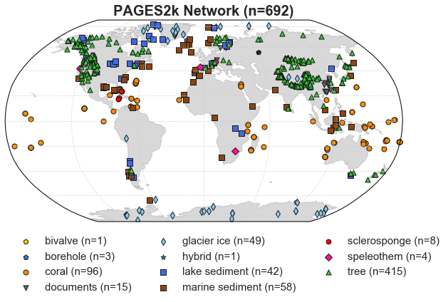

# notebooks
A library of notebooks illustrating use cases for analysis of LiPD files in Python.

## Additional packages being used
Several additional packages being used in these notebooks:
+ [pyleoclim](https://github.com/LinkedEarth/Pyleoclim_util): Python Package for the Analysis of Paleoclimate Data (`pip install pyleoclim`)
+ [p2k](https://github.com/fzhu2e/p2k): A collection of functions used for PAGES2k dataset analysis (`pip install p2k`)
+ [pathos](https://github.com/uqfoundation/pathos): Parallel graph management and execution in heterogeneous computing (`pip install pathos`)
+ [tqdm](https://github.com/tqdm/tqdm): A fast, extensible progress bar for Python and CLI (`pip install tqdm`)

Most of the essential functions are explicitly written in the notebooks, except
for the function to create composites due to its complexity, which is directly
imported from [p2k](https://github.com/fzhu2e/p2k).
For more related functionalities, please see [p2k](https://github.com/fzhu2e/p2k).

## Datasets being used
+ The PAGES2k dataset ([PAGES2k Consortium, 2017](https://www.nature.com/articles/sdata201788)): [download from figshare](https://ndownloader.figshare.com/files/8119937)
+ HadCRUT4 ([Morice CP, Kennedy JJ, Rayner NA, Jones PD, 2012](https://agupubs.onlinelibrary.wiley.com/doi/10.1029/2011JD017187)): [download from MetOffice](https://www.metoffice.gov.uk/hadobs/hadcrut4/data/current/gridded_fields/HadCRUT.4.6.0.0.median_netcdf.zip)

## Table of contents
+ [01. Convert a collection of LiPD files to a Pandas dataframe and save as a pickle file](https://nbviewer.jupyter.org/github/LinkedEarth/notebooks/blob/master/PAGES2k/01.lipd2df.ipynb)
+ [02. Plot the PAGES2k network on a map](https://nbviewer.jupyter.org/github/LinkedEarth/notebooks/blob/master/PAGES2k/02.plot_map.ipynb)

+ [03. Calculate and plot spectra of PAGES2k dataset by archive types](https://nbviewer.jupyter.org/github/LinkedEarth/notebooks/blob/master/PAGES2k/03.spectra_by_archive.ipynb)
+ [04. Make composites](https://nbviewer.jupyter.org/github/LinkedEarth/notebooks/blob/master/PAGES2k/04.composites.ipynb)

## References
+ PAGES2k Consortium (2017) A global multiproxy database for temperature reconstructions of the Common Era. Scientific Data 4:170088 EP.
+ Morice CP, Kennedy JJ, Rayner NA, Jones PD (2012) Quantifying uncertainties in global and regional temperature change using an ensemble of observational estimates: The HadCRUT4 data set. J. Geophys. Res. 117(D8):D08101.

## License
GNU Public License (see the details [here](LICENSE))
